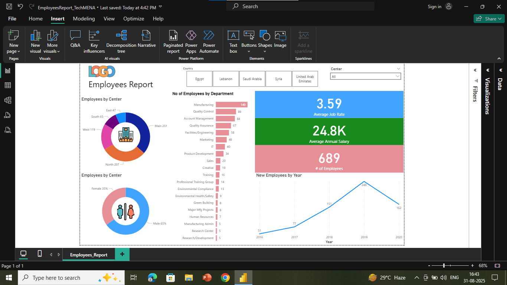

# hr-analytics-dashboard
"Power BI HR Analytics Dashboard — An interactive employee insights dashboard for TechMENA showcasing KPIs, salary trends, and workforce distribution with slicers and professional formatting."
"Power BI for Beginners: Interactive Dashboard Fundamentals

     

📌 Project Scenario

Your Role: Data Analyst
You are an HR Analytics Specialist at TechMENA, a rapidly growing tech company with offices across the Middle East. Your task is to analyze HR data and design an Employee Analytics Dashboard that highlights key workforce insights.
The dashboard includes:

Headcount
Average Salary
Performance Ratings
Employee Distribution across departments, centers, and gender

The goal is to deliver a professional, interactive dashboard for the HR Director, enabling better decision-making and workforce planning.

📖 Project Overview

This project is part of the Power BI for Beginners: Interactive Dashboard Fundamentals guided series. It covers the end-to-end process of building a business-ready dashboard — from data import to advanced analytics and interactivity.

By the end of the project, the dashboard showcases:

Core HR KPIs (Headcount, Avg. Salary, Avg. Rating)
Trend analysis of employee growth over time
Distribution analysis by gender, department, and center
Interactive filtering through slicers (country, center)
Professional formatting, titles, and visuals

🛠 Tools & Technologies Used

Microsoft Power BI Desktop
Built-in Power BI visuals: Clustered Bar Chart, Donut Chart, Line Chart, KPI Cards, Slicers
Data formatting & DAX basics
HR dataset (employee details with demographics, salary, performance rating, etc.)

🔑 Key Takeaways
Task 1 – Data Import and Metrics Development

Explored Power BI data import from multiple sources
Conducted initial data analysis to identify KPIs
Understood interface and data structures before visualization

Task 2 – Fundamental Chart Creation and Formatting

Added bar & donut charts with emphasis on labels for clarity
Removed clutter for better readability
Optimized dashboard space by resizing visuals

Task 3 – Data Distribution Visualization Techniques

Used donut charts for small category comparisons
Used bar charts for larger category comparisons
Selected charts based on data size & storytelling needs

Task 4 – Advanced Analytics and Performance Metrics

Implemented KPI Cards for headcount, average salary, job rating
Added a line chart for employee growth trends over time
Ensured accuracy and descriptive titles in all visuals

Task 5 – Interactive Elements and Dashboard Refinement

Added slicers (country & center) for interactivity
Designed a professional title and placed company logo
Enhanced visuals with icons and images
Finalized the report with polished formatting

📊 Final Dashboard Features

KPIs: Headcount, Avg. Salary, Avg. Performance Rating
Trend Analysis: New hires by year (2016–2020)
Distribution Analysis: By gender, department, and center
Interactivity: Country & center slicers for instant filtering
Professional Design: Clear titles, branded colors, logos, and images

## 📊 Dashboard Preview  

🚀 How to Use

Clone or download this repository
Open the .pbix file in Power BI Desktop
Explore the dashboard:
Use slicers to filter data by country or center

Review KPIs and charts to uncover HR insights
📂 Dataset

The dataset includes employee details such as gender, department, center, hire date, salary, and performance rating.
Used for educational/demo purposes.

🔮 Future Improvements

Add drill-through reports for department-level insights
Integrate predictive analytics for workforce planning
Automate dataset refresh for live dashboards

🏆 Key Learning

This project emphasizes that effective dashboards are not just about visuals but about clarity, interactivity, and storytelling. Every element — from chart choice to formatting — contributes to delivering insights that stakeholders can trust and act on."
